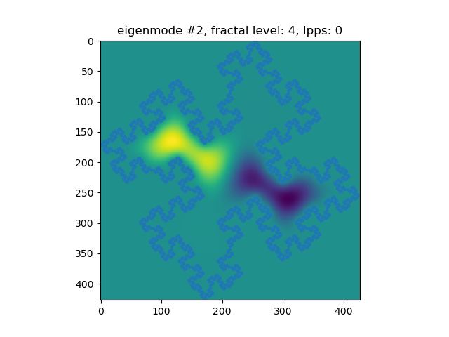
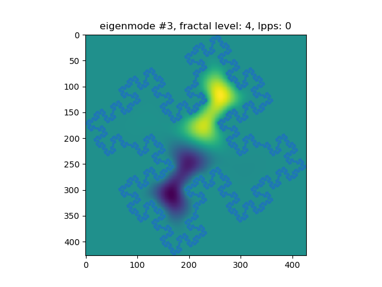
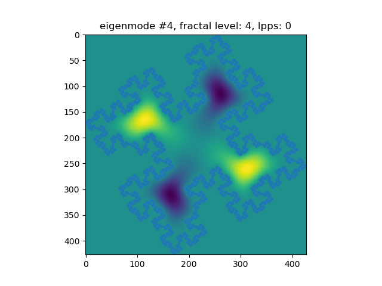
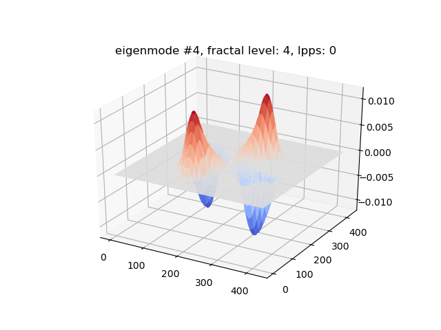
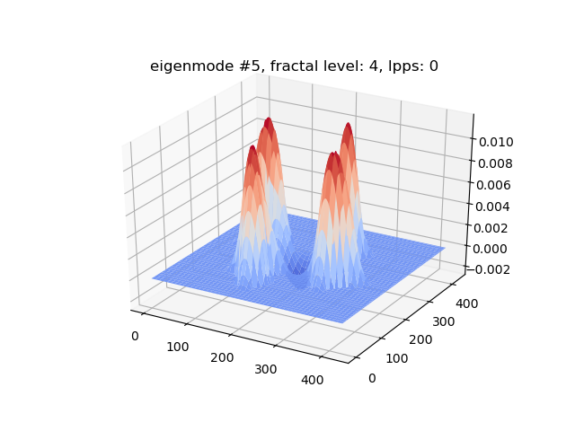
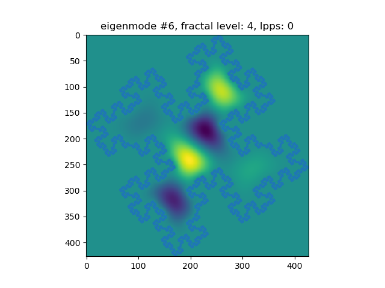
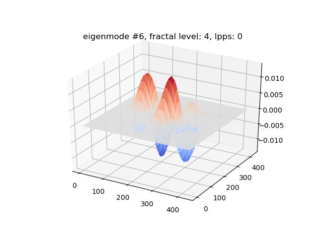
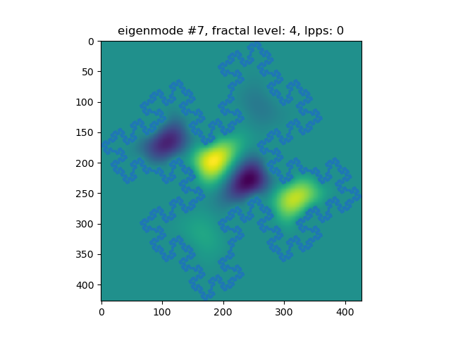
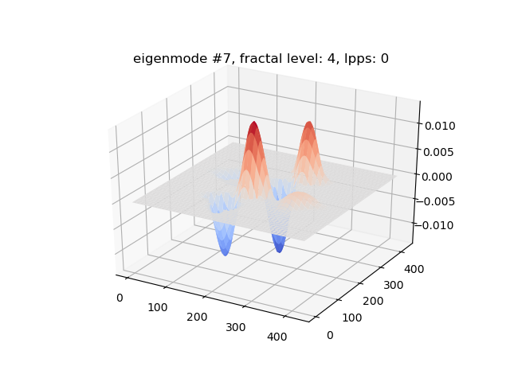
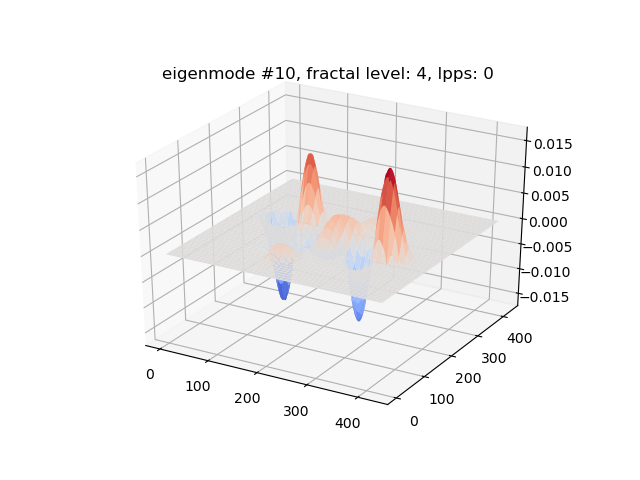

# Fractal Drums

 Project in computational physics. The main script is `main.jl`, it includes many of the other files, uses them to set up and solve the problem, and plots the resulting eigenmodes of the drum. It also prints some other results. 

The other files are as mentioned included in main, but some can be run by themselves to generate some plots.
* `setup.jl` - plots fractal by itself and the system lattice
* `quadratic_koch.jl` plots fractal only

| 2D plot   | 3D plot   |
|---------- | --------- |
|  |  |
|  |  |
|  |  |
|  |  |
|  |  |
|  |  |
|  |  |
|  |  |
|  |  |
|  |  |
| Wireframe plots | |
|  |  |
|  |  |
|  |  |
